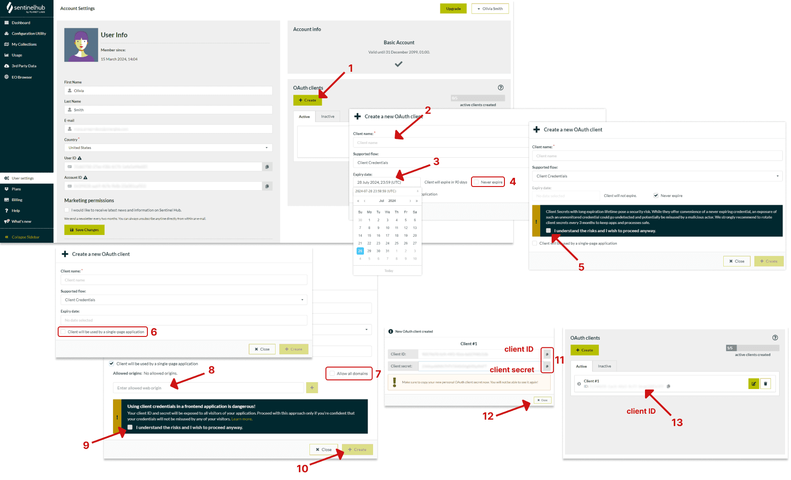

## Getting Started

BluEZZ is an open-source platform for ocean pollution monitoring using AI and satellite imagery. This guide will help you set up and run the project locally.

## Prerequisites

- **Node.js 20+** - Required for running the application
- **Encore CLI** - Backend framework for cloud-native TypeScript applications
- **PostgreSQL 14+** - Database (Encore handles this automatically)

### Installing Encore

```bash
# macOS/Linux
curl -L https://encore.dev/install.sh | bash

# Windows (PowerShell)
iwr https://encore.dev/install.ps1 | iex
```

## =' Project Setup

### 1. Clone the Repository

```bash
git clone https://github.com/leofmarciano/osshackathon-bluezz
cd osshackathon-bluezz
```

### 2. Install Dependencies

```bash
# Install root dependencies
bun install

# Install frontend dependencies
cd frontend
bun install
cd ..
```

### 3. Configure Secrets

BluEZZ requires several API keys and secrets to function. You'll need to set these up using Encore's secret management system.

#### Required Secrets

| Secret Name | Description | How to Obtain |
|------------|-------------|---------------|
| `AnthropicAPIKey` | Claude AI API key for pollution detection | [Get from Anthropic Console](https://console.anthropic.com/) |
| `ClerkSecretKey` | Authentication service secret key | [Get from Clerk Dashboard](https://dashboard.clerk.com/) |
| `FrontendURL` | Frontend URL for CORS and redirects | Use `http://localhost:5173` for local |
| `PolarKey` | Polar API key for donations (optional) | [Get from Polar](https://polar.sh/) |
| `PolarWebhookSecret` | Polar webhook secret (optional) | From Polar webhook settings |
| `SENTINELHUB_CLIENT_ID` | Sentinel Hub OAuth client ID | [Register at Sentinel Hub](https://www.sentinel-hub.com/) |
| `SENTINELHUB_CLIENT_SECRET` | Sentinel Hub OAuth client secret | From Sentinel Hub dashboard |

#### Setting Secrets for Local Development

```bash
# Set all required secrets for local development
encore secret set --type local AnthropicAPIKey
# Enter your Anthropic API key when prompted

encore secret set --type local ClerkSecretKey
# Enter your Clerk secret key when prompted

encore secret set --type local FrontendURL
# Enter: http://localhost:5173

encore secret set --type local SENTINELHUB_CLIENT_ID
# Enter your Sentinel Hub client ID

encore secret set --type local SENTINELHUB_CLIENT_SECRET
# Enter your Sentinel Hub client secret

# Optional: Polar integration for donations
encore secret set --type local PolarKey
encore secret set --type local PolarWebhookSecret
```

#### Setting Secrets for Other Environments

For production, development, or preview environments:

```bash
# Production
encore secret set --type prod <secret-name>

# Development and Preview
encore secret set --type dev,preview <secret-name>

# Specific environment
encore secret set --env <env-name> <secret-name>
```

### 4. Database Setup

Encore automatically manages the PostgreSQL database. 
```

## Running the Application

### Backend (Encore)

Start the Encore backend server:

```bash
encore run
```

The backend will be available at:
- API: `http://localhost:4000`
- Encore Dev Dashboard: `http://localhost:9400` (automatically opens)

### Frontend (React + Vite)

In a new terminal, start the frontend development server:

```bash
cd frontend
bunx vite dev
```

The frontend will be available at:
- Web App: `http://localhost:5173`

## Ocean Monitoring System

BluEZZ includes an autonomous ocean monitoring service that captures satellite imagery daily.

### How It Works

1. **Automated Scanning**: Cron job runs daily at 2 AM UTC
2. **Satellite Data**: Uses Sentinel-1 (oil detection) and Sentinel-2 (plastic detection)
3. **Tiling Algorithm**: Divides large areas into ~1km� tiles for processing
4. **AI Analysis**: Claude 4.1 Opus analyzes images for pollution

### Manual Testing

Trigger a manual scan (for testing):

```bash
curl -X POST http://localhost:4000/ocean-monitor/trigger-scan
```

View configured monitoring areas:

```bash
curl http://localhost:4000/ocean-monitor/areas
```

Check scan status:

```bash
curl http://localhost:4000/ocean-monitor/areas/{area-id}/status
```

### Default Monitoring Areas

The system comes pre-configured with Brazilian coastal areas:
- **Guanabara Bay**: Oil and plastic monitoring (10km radius)
- **Copacabana Beach**: Plastic debris focus (5km radius)
- **Angra dos Reis**: Oil spill monitoring (15km radius)

## API Keys Guide

### Anthropic (Claude AI)

1. Visit [console.anthropic.com](https://console.anthropic.com/)
2. Sign up or log in
3. Navigate to API Keys section
4. Create a new API key
5. Copy and save securely

**Note**: Claude 4.1 Opus provides excellent ocean pollution classification accuracy.

### Clerk (Authentication)

1. Visit [dashboard.clerk.com](https://dashboard.clerk.com/)
2. Create a new application
3. Go to API Keys section
4. Copy the Secret Key (starts with `sk_`)
5. Configure allowed origins: `http://localhost:5173`

### Sentinel Hub (Satellite Imagery)

1. Register at [sentinel-hub.com](https://www.sentinel-hub.com/)
2. Create a new OAuth client
3. Copy Client ID and Client Secret
4. Ensure you have processing units available

**Free Tier**: Sentinel Hub offers a free tier with limited processing units, sufficient for development.



### Polar (Optional - Donations)

1. Visit [polar.sh](https://polar.sh/)
2. Create an organization
3. Go to Settings > API
4. Generate API key and webhook secret

## Troubleshooting

### Common Issues

#### "Unable to parse UUID" Error
- Ensure PostgreSQL is using proper UUID type casting
- Check that area IDs are valid UUIDs

#### Sentinel Hub Authentication Failed
- Verify CLIENT_ID and CLIENT_SECRET are correctly set
- Check if you have available processing units
- Ensure your account is activated

#### Claude AI Rate Limiting
- The free tier has rate limits
- Implement delays between requests
- Consider upgrading for production use


### Environment Variables

Remember to set all secrets for each environment:

```bash
# Set secrets for production
encore secret set --type prod AnthropicAPIKey
encore secret set --type prod ClerkSecretKey
encore secret set --type prod FrontendURL
encore secret set --type prod SENTINELHUB_CLIENT_ID
encore secret set --type prod SENTINELHUB_CLIENT_SECRET
```

## Monitoring

### Encore Dev Dashboard

While running locally, access the Encore dashboard at `http://localhost:9400` to:
- View API endpoints
- Monitor performance
- Check logs
- Inspect database queries

### Logs

View application logs:

```bash
# Stream logs from local environment
encore logs

# Stream logs from production
encore logs --env prod
```

## Contributing

### Development Workflow

1. Fork the repository
2. Create a feature branch
3. Make your changes
4. Run tests
5. Submit a pull request

## License

MIT License - see [LICENSE](../LICENSE) file for details.

## Support

- GitHub Issues: [Report bugs or request features](https://github.com/leofmarciano/osshackathon-bluezz/issues)
- Documentation: You're reading it!
- Community: Coming soon in 2025

## Built With

- **Frontend**: React 18, Vite, TailwindCSS, shadcn/ui
- **Backend**: Encore.ts (TypeScript), PostgreSQL
- **AI**: Claude 4.1 Opus API
- **Satellite Data**: Sentinel Hub (ESA)
- **Authentication**: Clerk
- **Payments**: Polar (optional)

## Key Features

- **100% AI-Generated Code**: Built with Leap.new (50%+) and Claude Code
- **Real-time Monitoring**: 24/7 satellite surveillance
- **Community Governance**: Democratic voting on actions
- **Full Transparency**: Open source, public audit trail
- **Zero Admin Fees**: 100% of donations go to missions

---

**BluEZZ** - Together, we clean the oceans. With radical transparency.

*This project is part of the OSS Hackathon 2025*
